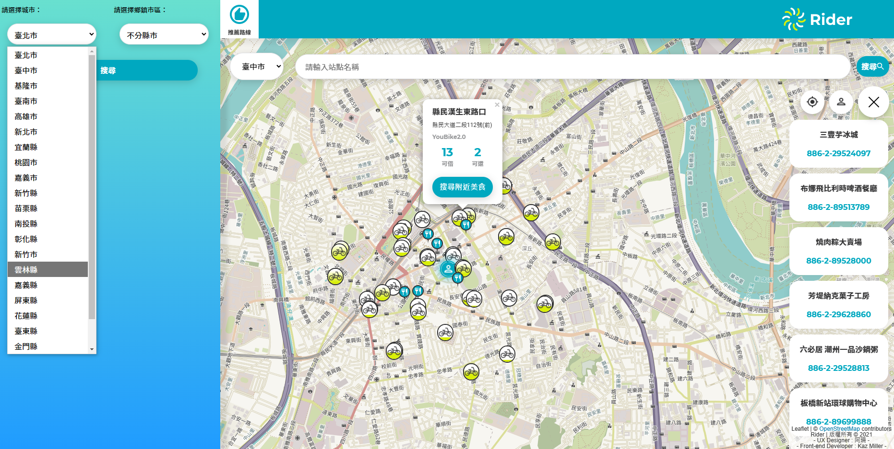

# THE F2E 3rd Week-2 作品：自行車道地圖資訊整合網

 ### `作品連結：`
 [Taiwan Rider](https://taiwanrider.netlify.app/#/)
 
 
 
 ### `作者：`
 UI設計師：[阿珊](https://www.figma.com/file/ApyxH6B7FcG5milnkK6PL7/week2)\
 前端工程師：Kaz Miller\
 THE F2E 3rd : https://2021.thef2e.com/

##  User story (使用者故事)

    1.我可以透過網站上的地圖服務，觀看離自己最近的 YouBike 租借站位點
    2.我可以透過網站上的地圖服務，能看到每個 YouBike 租借站位點，目前的租借狀況(可租借車數/可歸還車數)
    3.我可以用圖文列表模式，搜尋各市區的腳踏車路線列表，點擊路線後，會顯示對應的路線圖
    4.我能透過 PC 網站瀏覽，也能透過 Mobile 來瀏覽介面 

